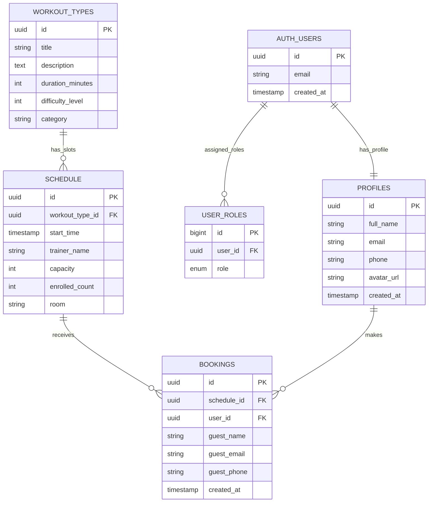

# SportSpot

SportSpot is a modern fitness management SaaS designed to help studios and members manage classes end-to-end through a clean, responsive, **Glassmorphism-inspired UI**.

The platform supports two primary roles:
- **Members**: browse classes, view class details, book sessions, manage upcoming reservations, and maintain profile data.
- **Admins**: full CRUD control over schedules, bookings, and users to operate the fitness business efficiently.

---

## 1) Project Description

SportSpot combines fast client-side rendering with Supabase-powered backend services to deliver a lightweight but production-ready fitness workflow:
- Public and authenticated experiences in a single app.
- Real-time class discovery and booking.
- Secure authentication and profile lifecycle.
- Role-aware dashboard behavior for member/admin experiences.

The product direction emphasizes premium visual quality (blur overlays, soft shadows, rounded cards, and modern gradients) while keeping implementation in vanilla web technologies.

---

## 2) Architecture

### Frontend
- **Vanilla JavaScript (ES Modules)**
- **HTML5 templates**
- **CSS3** with a custom Glassmorphism style system
- **Bootstrap + Bootstrap Icons** for utilities and iconography
- **Vite** for development server and production build

### Backend / BaaS
- **Supabase Auth**: email/password authentication and session management
- **Supabase PostgreSQL**: relational data model for users, classes, schedules, and bookings
- **Supabase RPC / SQL functions**: e.g. top-class ranking logic
- **Supabase Storage**: profile avatar and class image support
- **Supabase RLS**: role-based access and row-level authorization policies

### Runtime Model
- SPA-like route handling in the frontend (`src/router.js`) with clean paths (e.g. `/dashboard`, `/classes`, `/schedule`, `/profile`, `/admin`, `/class-details/:slug`).
- Data is fetched directly from Supabase via `@supabase/supabase-js`.

---

## 3) Database Schema

The core database model centers around class definitions, scheduled sessions, and user bookings.

### Main Tables

- **`profiles`**
  - Extends authentication users with application profile fields.
  - Linked 1:1 to `auth.users` through `profiles.id` (`uuid`, cascade delete).
  - Stores member information (name, email, phone, avatar URL, timestamps).

- **`workout_types`**
  - Master catalog of class templates (title, description, duration, difficulty, category, media metadata).
  - Referenced by scheduled sessions.

- **`schedule`**
  - Concrete class slots (date/time, trainer, room, capacity, enrolled count).
  - Each row references one `workout_types` record via `workout_type_id`.

- **`bookings`**
  - Reservation records for class slots.
  - Connects a user (`profiles.id` via `user_id`) to a scheduled session (`schedule.id` via `schedule_id`).
  - Supports guest metadata fields where needed.

### Relationship Summary

- `profiles` (1) -> (N) `bookings`
- `schedule` (1) -> (N) `bookings`
- `workout_types` (1) -> (N) `schedule`

In other words, **`bookings` is the join layer between members (`profiles`) and class sessions (`schedule`)**.

### Database Schema Design

The diagram below is GitHub-native (Mermaid) and visualizes the core SportSpot schema and relationships:



### RBAC and Security (Supabase)

- Role mapping is maintained through a dedicated `user_roles` table.
- RLS policies enforce role-aware behavior.
- Admin-level permissions are applied to management operations (e.g., class/schedule maintenance).

---

## 4) Key Features

### Dynamic “Top Classes” logic
- Landing page computes and renders top-performing classes.
- Primary path uses Supabase RPC: `get_top_active_classes(window_days, result_limit)`.
- Fallback path computes rankings client-side from upcoming schedule rows if RPC is unavailable.
- Ranking prioritizes upcoming session volume, then current enrollment demand.

### Featured Activity (landing hero)
- Landing page selects one featured session from upcoming `schedule` rows and displays it in the hero card.
- Selection priority:
  - First, the earliest **bookable evening session** (from today/next day onward) within a 48-hour lookahead window.
  - If none exists, fallback to the earliest next bookable session.
- Evening qualification rule: to be considered “featured” in the primary selection path, the session must start at or after **6:00 PM (18:00)** local time.
- Bookable means: valid `start_time`, starts in the future, and has remaining spots (`capacity - enrolled_count > 0`).
- CTA behavior is role/session aware:
  - Guest users: `Reserve now` redirects to login.
  - Authenticated users with no booking: `Reserve now` creates a booking.
  - Authenticated users with existing booking: `Cancel Booking` deletes their reservation.
  - Full sessions: CTA is disabled.
- UI state updates immediately after reserve/cancel by adjusting local `enrolled_count` and re-rendering the card.
- Reserve/cancel actions trigger toast feedback for success and error outcomes.

### Secure profile management
- Profile data is tied to authenticated users (`auth.users` + `profiles`).
- Avatar uploads are supported through a dedicated Supabase Storage bucket with ownership-aware policies.
- Session-aware UI/route behavior protects authenticated screens.

### Admin dashboard with real-time filtering
- Admin-facing flows provide management control over operational data.
- Filtering/search patterns are designed for fast updates over live schedule and booking datasets.
- Role-aware UI keeps privileged actions available only to admin users.

---

## 5) Local Setup (Development)

### Prerequisites
- **Node.js 18+** (recommended LTS)
- **npm 9+**
- A **Supabase project** (cloud or local)

### 1. Install dependencies
```bash
npm install
```

### 2. Configure environment variables
Create a `.env` file from `.env.example` and provide your Supabase project values:

```env
VITE_SUPABASE_URL=https://your-project-ref.supabase.co
VITE_SUPABASE_PUBLISHABLE_KEY=your_publishable_key
```

### 3. Apply database migrations
Run SQL files from `supabase/migrations/` in order against your Supabase project (using Supabase SQL Editor or CLI workflow).

### 4. (Optional) Seed development data
```bash
npm run seed:db
```

### 5. Start the app
```bash
npm run dev
```

### 6. Build for production
```bash
npm run build
npm run preview
```

---

## 6) Folder Structure (Key Files & Purpose)

```text
SportSpot/
├─ src/
│  ├─ main.js                 # App bootstrap entry
│  ├─ router.js               # Client-side route resolution + layout rendering
│  ├─ components/             # Reusable UI modules (header, footer, cards, filters, toast)
│  ├─ lib/
│  │  ├─ supabaseClient.js    # Supabase client initialization + env fallback logic
│  │  └─ pageTitle.js         # Dynamic document title helpers
│  ├─ pages/                  # Route-level pages (index, login, register, dashboard, etc.)
│  └─ styles/                 # Global CSS and shared style primitives
├─ supabase/
│  ├─ migrations/             # Versioned SQL schema and policy changes
│  └─ seed-data/              # Seed scripts and development media assets
├─ index.html                 # Vite host HTML shell
├─ package.json               # Scripts, dependencies, and project metadata
└─ .env.example               # Environment variable template
```

### Page modules (`src/pages/`)
- **`index/`**: landing page, hero, top classes, social proof.
- **`login/`, `register/`**: auth flows.
- **`dashboard/`**: personalized member overview.
- **`classes/`**: class browsing and filtering.
- **`class-details/`**: deep class information and booking entrypoint.
- **`schedule/`**: calendar/session selection and reservation flow.
- **`profile/`**: account data and avatar management.
- **`admin/`**: admin-specific operation and management interface.

---

## Routes (Current)

- `/`
- `/login`
- `/register`
- `/dashboard`
- `/classes`
- `/class-details/:slug`
- `/schedule`
- `/profile`
- `/admin`

---

## Tech Stack Summary

- **Frontend**: Vanilla JS, HTML5, CSS3, Bootstrap, Bootstrap Icons, Vite
- **Backend**: Supabase Auth, PostgreSQL, RPC, Storage, RLS
- **Data Access**: `@supabase/supabase-js`

---

## Notes for Contributors

- Keep SQL migration history append-only in `supabase/migrations/`.
- Preserve role-aware behavior and RLS assumptions when adding new data features.
- Reuse existing component/page structure to maintain UI consistency.
